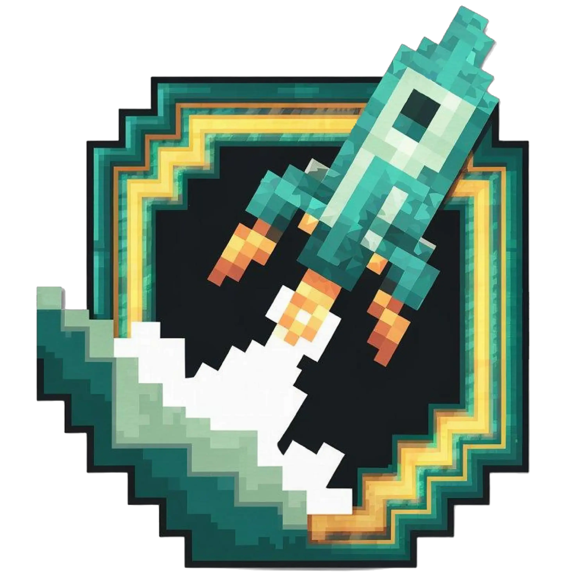

<p align="center">
  
  <h2 align="center">OpenLauncher</h2>
  <p align="center">An open-source Minecraft launcher for Windows and Linux built with Electron.</p>
</p>

<p align="center">
    
    
    
    
    
</p>
<br>

**Note**: Currently, OpenLauncher is designed only for Windows and Linux.

## 📢 Legacy Python Version

The previous Python-based version of OpenLauncher (legacy) is still available for download in the [Releases](https://github.com/CesarGarza55/OpenLauncher/releases) section. The last version of the legacy system was **Beta-1.7.4**.

The new Electron-based version represents a complete rewrite with improved performance, better cross-platform compatibility, and a modern architecture.

## 🚀 Features

- **Microsoft Account Login**: Supports logging in with an official Microsoft account.
- **Modern Interface**: Built with React and Electron for a modern and customizable look.
- **Minecraft Compatibility**: Manages Minecraft versions using custom implementation.
- **Open Source**: Easily extendable and modifiable by the community.
- **Multiplatform**: Available for Windows and Linux operating systems.
- **Multilanguage Support**: Supports multiple languages for a better user experience.
- **Auto-updater**: Built-in update system for seamless updates.

## 📋 Requirements

- Node.js 18 or higher
- npm (Node.js package manager)
- Java (for running Minecraft)

## 🛠️ Compilation

### Windows

1. Clone the repository:
    ```bash
    git clone https://github.com/CesarGarza55/OpenLauncher.git
    cd OpenLauncher
    ```

2. Install dependencies:
    ```bash
    npm install
    ```

3. Compile:
    Run the `compile-windows.bat` script to compile the project.

    ```bash
    compile-windows.bat
    ```

    This will generate:
    - `OpenLauncher.exe` (NSIS installer)
    - `OpenLauncher-Portable-Windows.exe` (portable version)

    **Note**: The script requires NSIS to be installed for the installer. You can download NSIS from [nsis.sourceforge.io](https://nsis.sourceforge.io/Download).

4. You need to install Java to be able to play:

    [https://www.java.com/es/download/](https://www.java.com/es/download/)

### Linux

1. Clone the repository:
    ```bash
    git clone https://github.com/CesarGarza55/OpenLauncher.git
    cd OpenLauncher
    ```

2. Install dependencies:
    ```bash
    npm install
    ```

3. Compile:
    Execute the script to start the compilation process:

    ```bash
    chmod +x compile-linux.sh
    ./compile-linux.sh
    ```

    This will generate:
    - `OpenLauncher.deb` (for Debian/Ubuntu-based systems)
    - `OpenLauncher-Portable-Linux.tar.gz` (for Arch/Fedora/Other distributions)

4. Install:
   1. For Debian/Ubuntu-based systems:
   ```bash
   sudo dpkg -i OpenLauncher.deb
   ```

   2. For Arch/Fedora/Other distributions:
   ```bash
   tar -xzf OpenLauncher-Portable-Linux.tar.gz
   cd OpenLauncher
   ./OpenLauncher
   ```

## 📥 Download options

- Windows Installer: `OpenLauncher.exe`
- Windows Portable: `OpenLauncher-Portable-Windows.exe`
- Linux Installer (Debian/Ubuntu): `OpenLauncher.deb`
- Linux Portable (Arch/Fedora/Other): `OpenLauncher-Portable-Linux.tar.gz`


## 🕹️ Usage

The main interface shows different sections:
You can create, edit, and switch between multiple profiles.
Each profile can be either a local profile or linked to a Microsoft account, and it stores its own configuration.


To install a version, use the following interface where you select the version and click install:


By default the following JVM arguments are used:

   ```bash
   -Xmx2G -XX:+UnlockExperimentalVMOptions -XX:+UseG1GC -XX:G1NewSizePercent=20 -XX:G1ReservePercent=20 -XX:MaxGCPauseMillis=50 -XX:G1HeapRegionSize=32M
   ```

If you want to change something you need to do it from the settings window.


## 🔑 Sign in with Microsoft Account
To log in with your official Microsoft account, follow these steps:

1. Open the launcher.
2. Click on "Login with Microsoft"
3. Enter your Microsoft account with Minecraft purchased
4. Once the authentication process is complete, you will see your account appear in the launcher


### Using your own Microsoft Entra Client ID

The official OpenLauncher builds use a hosted authentication API (a proxy) which is not published
as open-source. If you fork this repository and want to use your own Microsoft App (Client ID)
instead of a hosted API, you need to implement your own authentication flow.

Steps for forks:
1. Register an app in Microsoft Entra [https://entra.microsoft.com](https://entra.microsoft.com): App registrations → New registration.
    - Copy the Application (client) ID — this is your `CLIENT_ID`.
    - On `Authentication` click on `Add a platform` and select `Mobile and desktop applications`
    - Add Redirect URI: `http://localhost:8080/callback` (or your chosen URI).
2. Implement the OAuth flow in your Electron main process or backend.
3. Ensure required permissions/scopes for Xbox Live / Minecraft are granted (you need to apply to [this form](https://forms.office.com/Pages/ResponsePage.aspx?id=v4j5cvGGr0GRqy180BHbR-ajEQ1td1ROpz00KtS8Gd5UNVpPTkVLNFVROVQxNkdRMEtXVjNQQjdXVC4u))
4. Run the launcher locally and use "Login with Microsoft".

Security reminder: never commit client secrets or refresh tokens to a public repository. For
production use, host an auth backend to store and rotate secrets securely.

Troubleshooting:
- If the browser doesn't redirect back, verify the redirect URI in the Entra Admin Panel app matches `REDIRECT_URL`.
- If refresh tokens fail, ensure `offline_access` scope is requested.


## Mod Manager

You can install, activate and deactivate mods with the mod manager:


## 🧪 Testing
My PC Specs:
- CPU: AMD Ryzen 5 5600g (3.90 GHz)
- GPU: Radeon Vega 7 Graphics
- RAM: 32GB DDR4 DIMM 3200MT/s
- Operating System: Windows 11 24H2 (26100.6584)

Tested Minecraft Version:
- Launcher version: Release 1.0.0
- RAM Allocated: 8GB
- Minecraft Version: 1.21.11
- Fabric: 0.18.4
- Shaders: [MakeUp-UltraFast-9.1b](https://modrinth.com/shader/makeup-ultra-fast-shaders)


## 🤝 Contributing
Contributions are welcome! Follow these steps to contribute:

- Fork the repository.
- Create a new branch (git checkout -b feature/new-feature).
- Make the necessary changes and commit (git commit -am 'Add new feature').
- Push the changes to your repository (git push origin feature/new-feature).
- Open a Pull Request on GitHub.

## 📜 License
This project is licensed under the GPL-2.0 License. For more details, see the [LICENSE](https://github.com/CesarGarza55/OpenLauncher/blob/main/LICENSE) file.

## 🙏 Credits
OpenLauncher uses the following libraries and tools:

- Electron
- React
- Node.js
- electron-builder
- Vite

## ⚠️ Disclaimer

This project is in no way related to or associated with Mojang AB or Microsoft. Minecraft is a registered trademark of Mojang AB and Microsoft. All trademarks and intellectual property rights mentioned in this project are the exclusive property of their respective owners. No files belonging to Mojang AB or Microsoft are hosted on servers owned by us.

You can review the Terms and Conditions and the Privacy Policy regarding the use of the application at the following link:

- [Terms and Conditions and Privacy Policy](https://openlauncher.codevbox.com/terms_app)

By using OpenLauncher, you agree to comply with these terms and acknowledge that you have read and understood my privacy practices. I am committed to protecting your personal information and ensuring transparency in how I handle your data. For any questions or concerns, please contact me at [support@codevbox.com](mailto:support@codevbox.com?subject=OpenLauncher%20Terms%20of%20Service).

Thank you for using OpenLauncher!